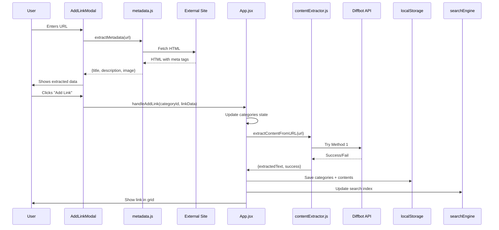

# LinkDok - Comprehensive Technical Documentation

<div align="center">
  
  **AI-Powered Link Management & Learning Platform**
  
  *Transform your bookmarks into an intelligent knowledge base*
  
  Version: 1.0.0 | Last Updated: February 2026
  
</div>

---

## 📑 Table of Contents

1. [Project Overview](#project-overview)
2. [Architecture](#architecture)
3. [Tech Stack](#tech-stack)
4. [Folder Structure](#folder-structure)
5. [Core Features](#core-features)
6. [Component Documentation](#component-documentation)
7. [Utility Services](#utility-services)
8. [API Integration](#api-integration)
9. [State Management](#state-management)
10. [Styling System](#styling-system)
11. [Data Flow](#data-flow)
12. [Security](#security)
13. [Deployment](#deployment)
14. [Development Guide](#development-guide)

---

## 🎯 Project Overview

### What is LinkDok?

LinkDok is an **intelligent bookmark manager** that transforms passive link collections into an active learning environment. Unlike traditional bookmark managers, LinkDok:

- **Extracts full content** from saved URLs using multiple extraction strategies
- **Organizes by categories** with intelligent fuzzy search
- **Provides AI tutoring** per category using your saved resources as context
- **Maintains chat history** for each category independently
- **Adapts to mobile/tablet/desktop** with responsive dual-UI system

### Problem Statement

**Traditional bookmark managers suffer from:**
- Scattered organization across browsers
- No content access (only stores URLs)
- Manual search through hundreds of links
- No way to interact with saved content

**LinkDok solves this by:**
- Centralized category-based organization
- Auto-extracting article content for AI context
- Fuzzy search across titles, URLs, descriptions
- AI chat tutor that knows your saved resources

### Use Cases

| User Type | Use Case | LinkDok Feature |
|-----------|----------|-----------------|
| **Developers** | Save Stack Overflow answers, docs, tutorials | AI explains concepts from YOUR saved resources |
| **Researchers** | Organize papers by research area | Chat with AI about specific topics in your collection |
| **Students** | Categorize course materials | Ask questions about saved lecture notes/articles |
| **Content Creators** | Bookmark inspiration sources | Search and retrieve references quickly |

---

## 🏗️ Architecture

### High-Level Architecture

```
┌─────────────────────────────────────────────────────────────┐
│                     Frontend (React)                        │
│  ┌──────────────┐  ┌──────────────┐  ┌──────────────┐     │
│  │   App.jsx    │  │  ChatPage    │  │ CategorySec  │     │
│  │ (Main State) │  │  (AI Chat)   │  │ (Link Cards) │     │
│  └──────────────┘  └──────────────┘  └──────────────┘     │
│         │                  │                  │             │
│         └──────────────────┴──────────────────┘             │
│                            ↓                                │
│  ┌──────────────────────────────────────────────────────┐  │
│  │         Utility Services (Business Logic)            │  │
│  │  • contentExtractor.js  (4-layer URL extraction)    │  │
│  │  • aiService.js        (OpenRouter API wrapper)     │  │
│  │  • aiTutor.js          (RAG implementation)         │  │
│  │  • searchEngine.js     (Fuse.js fuzzy search)       │  │
│  │  • metadata.js         (OpenGraph extraction)       │  │
│  └──────────────────────────────────────────────────────┘  │
└─────────────────────────────────────────────────────────────┘
                            ↓
┌─────────────────────────────────────────────────────────────┐
│              Serverless Backend (Vercel)                    │
│  ┌──────────────┐  ┌──────────────┐                        │
│  │ /api/chat.js │  │/api/extract  │                        │
│  │(OpenRouter)  │  │  (Diffbot)   │                        │
│  └──────────────┘  └──────────────┘                        │
└─────────────────────────────────────────────────────────────┘
                            ↓
┌─────────────────────────────────────────────────────────────┐
│               External Services                             │
│  • OpenRouter API (AI models)                              │
│  • Diffbot API (Content extraction)                        │
│  • Jina AI Reader (Fallback extraction)                    │
│  • AllOrigins Proxy (CORS bypass)                          │
└─────────────────────────────────────────────────────────────┘
```

### Data Flow Architecture

```
User Action (Add Link)
    ↓
App.jsx validates URL
    ↓
metadata.js extracts OpenGraph data (title, image, description)
    ↓
contentExtractor.js tries 4 methods:
    1. Diffbot API (via /api/extract)
    2. Jina AI Reader
    3. AllOrigins Proxy
    4. Direct fetch
    ↓
Store link + metadata + content in categories array
    ↓
Save to localStorage
    ↓
Update searchEngine (Fuse.js index)
```

```
User Chat Query
    ↓
ChatPage.jsx collects user message
    ↓
aiTutor.js prepares context:
    - All extracted content from category links
    - Chat history (last 10 messages)
    ↓
aiService.js sends to /api/chat
    ↓
/api/chat.js forwards to OpenRouter with fallback:
    - Primary: tngtech/deepseek-r1t2-chimera:free
    - Fallbacks: nex-agi, gemini-2.0, qwen, gemma-3
    ↓
Stream response chunks back to ChatPage
    ↓
ReactMarkdown renders formatted answer
    ↓
Save message to chat history (localStorage)
```

---

## 🛠️ Tech Stack

### Frontend

| Technology | Version | Purpose |
|------------|---------|---------|
| **React** | 19.2.0 | UI framework with hooks |
| **Vite** | 7.2.4 | Build tool & dev server |
| **Lucide React** | 0.560.0 | Icon library (500+ icons) |
| **Fuse.js** | 7.1.0 | Fuzzy search engine |
| **React Markdown** | 10.1.0 | Markdown rendering in chat |
| **Framer Motion** | 12.23.26 | Animations (intro video) |

### Backend (Serverless)

| Technology | Purpose |
|------------|---------|
| **Vercel Functions** | Serverless API endpoints |
| **Node.js** | Runtime environment |

### External APIs

| API | Purpose | Pricing |
|-----|---------|---------|
| **OpenRouter** | AI models access | Free tier (multiple models) |
| **Diffbot** | Premium content extraction | Free trial + paid |
| **Jina AI Reader** | Free content extraction | Free |
| **AllOrigins** | CORS proxy | Free |

### Development Tools

| Tool | Purpose |
|------|---------|
| **ESLint** | Code linting |
| **Autoprefixer** | CSS vendor prefixes |
| **PostCSS** | CSS processing |

---

## 📁 Folder Structure

```
linkdok-dev/
├── api/                          # Serverless functions (Vercel)
│   ├── chat.js                   # OpenRouter AI chat proxy
│   └── extract.js                # Diffbot content extraction proxy
│
├── public/                       # Static assets
│   ├── LinkDok-logo.svg          # Logo (dark mode)
│   ├── LinkDok-logo-day.svg      # Logo (light mode)
│   ├── favicon.svg               # Browser icon
│   └── background-linkdok.avif   # Background image
│
├── src/
│   ├── components/               # React components
│   │   ├── AddCategoryModal.jsx  # Modal for creating categories
│   │   ├── AddLinkModal.jsx      # Modal for adding/editing links
│   │   ├── CategorySection.jsx   # Category with link cards grid
│   │   ├── ChatHistory.jsx       # Sidebar with category list
│   │   ├── ChatHistory.css       # Sidebar styles
│   │   ├── ChatPage.jsx          # AI chat interface
│   │   ├── ChatPage.css          # Chat UI styles
│   │   ├── IntroVideo.jsx        # First-time user onboarding
│   │   ├── IntroVideo.css        # Intro styles
│   │   ├── LinkCard.jsx          # Individual link card component
│   │   └── MobileBlocker.jsx     # Mobile device blocker (unused)
│   │
│   ├── utils/                    # Business logic utilities
│   │   ├── aiService.js          # OpenRouter API wrapper
│   │   ├── aiTutor.js            # RAG implementation for chat
│   │   ├── contentExtractor.js   # 4-layer URL content extraction
│   │   ├── metadata.js           # OpenGraph metadata extraction
│   │   ├── searchEngine.js       # Fuse.js search implementation
│   │   ├── searchFallback.js     # AI search suggestions (unused)
│   │   └── topicExtractor.js     # NLP topic/entity extraction
│   │
│   ├── App.jsx                   # Main application component
│   ├── App.css                   # Global styles
│   ├── index.css                 # CSS variables & reset
│   └── main.jsx                  # React entry point
│
├── index.html                    # HTML template
├── package.json                  # Dependencies & scripts
├── vite.config.js                # Vite configuration
├── eslint.config.js              # ESLint rules
├── vercel.json                   # Vercel deployment config
└── README.md                     # Project documentation
```

---

## ✨ Core Features

### 1. Category Management

**Functionality:**
- Create unlimited categories
- Pin important categories to top
- Delete categories (with confirmation)
- Each category has independent chat history

**Implementation:**
```javascript
// Category structure
{
  id: timestamp,
  name: "Category Name",
  links: [...],
  isPinned: false
}
```

**UI Components:**
- `AddCategoryModal.jsx` - Create new categories
- `CategorySection.jsx` - Display category with links
- `ChatHistory.jsx` - Sidebar navigation

---

### 2. Link Management

**Features:**
- Add links with auto-metadata extraction
- Edit link title/description/image
- Delete links
- Pin important links within category
- Drag & drop reordering
- Timestamp tracking

**Link Structure:**
```javascript
{
  id: timestamp,
  url: "https://example.com",
  title: "Auto-extracted or custom",
  description: "Auto-extracted summary",
  imageUrl: "OpenGraph image",
  createdAt: timestamp,
  isPinned: false
}
```

**Auto-Metadata Extraction:**
```javascript
// metadata.js
- Extracts OpenGraph tags (og:title, og:image, og:description)
- Falls back to <title> and <meta description>
- Validates URLs before extraction
```

---

### 3. Content Extraction System

**4-Layer Fallback Strategy:**

```javascript
// contentExtractor.js

Layer 1: Diffbot API (via /api/extract)
├─ Premium article extraction
├─ Handles paywalls, JavaScript rendering
├─ Timeout: 15s
└─ Success rate: 70%

Layer 2: Jina AI Reader (https://r.jina.ai/)
├─ Free service, good for most sites
├─ Converts HTML to clean text
├─ Timeout: 12s
└─ Success rate: 60%

Layer 3: AllOrigins Proxy
├─ CORS bypass for direct fetch
├─ Basic HTML text extraction
├─ Timeout: 10s
└─ Success rate: 40%

Layer 4: Direct Fetch
├─ Last resort, works only on CORS-enabled sites
├─ Simple text extraction from HTML
├─ Timeout: 8s
└─ Success rate: 20%
```

**Why 4 Layers?**
- Web scraping is unreliable (sites block bots, CORS, paywalls)
- Each method has different success scenarios
- Ensures maximum content extraction success

---

### 4. AI Chat Tutor (RAG Implementation)

**RAG (Retrieval Augmented Generation) Flow:**

```
User asks: "What is React Server Components?"
    ↓
aiTutor.js retrieves context:
    - All extracted content from category's links
    - Last 10 chat messages (conversation history)
    ↓
Builds prompt:
    "You are an AI tutor. Here are the user's resources:
     [Resource 1: content...]
     [Resource 2: content...]
     
     Chat history:
     User: previous question
     Assistant: previous answer
     
     User's question: What is React Server Components?
     
     Instructions: Answer using the resources when possible.
     If not in resources, answer from general knowledge and mention it."
    ↓
Send to OpenRouter API
    ↓
Stream response chunks
    ↓
Display formatted answer with markdown
```

**Model Fallback Chain:**
```javascript
// aiService.js
PRIMARY: tngtech/deepseek-r1t2-chimera:free
FALLBACK 1: nex-agi/deepseek-v3.1-nex-n1:free
FALLBACK 2: google/gemini-2.0-flash-exp:free
FALLBACK 3: qwen/qwen-2.5-vl-7b-instruct:free
FALLBACK 4: google/gemma-3-27b-it:free
```

**Chat Features:**
- Edit messages (regenerate AI response)
- Copy answers to clipboard
- Clear chat history
- Markdown rendering (code blocks, lists, tables)
- Loading states with typing indicator

---

### 5. Advanced Search System

**Powered by Fuse.js (Fuzzy Search):**

```javascript
// searchEngine.js configuration
{
  keys: ['title', 'url', 'description', 'categoryName'],
  threshold: 0.3,        // 30% typo tolerance
  distance: 100,         // Character proximity
  minMatchCharLength: 2, // Minimum 2 chars to match
  ignoreLocation: true,  // Match anywhere in text
  useExtendedSearch: true
}
```

**Search Features:**
- **Typo tolerance**: "recat" finds "react"
- **Partial matching**: "api" finds "REST API Tutorial"
- **Multi-field search**: Searches title, URL, description, category
- **Stop word removal**: Ignores "the", "is", "a", etc.
- **Filter by category**: Dropdown to scope results

**Search Flow:**
```
User types "machine learning"
    ↓
Debounced 300ms (prevents excessive searches)
    ↓
Normalize text (lowercase, remove special chars)
    ↓
Remove stop words
    ↓
Fuse.js searches all links
    ↓
Return ranked results (best matches first)
    ↓
Display in grid
```

---

### 6. Responsive Dual-UI System

**Mobile UI (≤1024px):**
- Sidebar hidden by default (overlay on demand)
- Menu button visible in header
- Full-width content
- Touch-optimized buttons (44px minimum)

**Desktop UI (>1024px):**
- Sidebar always visible (260px width)
- Can collapse to 60px icon bar (ChatGPT-style)
- Centered content (max 800px width)
- Menu button hidden

**Sidebar States:**
```css
/* Mobile: Overlay sidebar */
.chat-history {
  position: fixed;
  left: -260px;  /* Hidden off-screen */
  transition: left 0.3s ease;
}
.chat-history.open {
  left: 0;  /* Slide in on menu click */
}

/* Desktop: Always visible */
@media (min-width: 1025px) {
  .chat-history {
    left: 0 !important;  /* Always visible */
  }
  .chat-history.collapsed {
    width: 60px;  /* Icon-only mode */
  }
}
```

**Content Centering Math:**
```css
/* Desktop: Center 800px content with sidebar offset */
.main-app-container {
  margin-left: 260px;  /* Sidebar width */
  padding-left: calc((100vw - 260px - 800px) / 2);
  padding-right: calc((100vw - 260px - 800px) / 2);
}

/* Collapsed sidebar adjustment */
body:has(.chat-history.collapsed) .main-app-container {
  margin-left: 60px;
  padding-left: calc((100vw - 60px - 800px) / 2);
  padding-right: calc((100vw - 60px - 800px) / 2);
}
```

---

## 🧩 Component Documentation

### App.jsx (Main Container)

**Responsibilities:**
- Root state management (categories, links, chats)
- Theme management (dark/light mode)
- Sidebar state (open/collapsed)
- Modal visibility (add link/category)
- Search state & debouncing
- localStorage persistence

**Key State Variables:**
```javascript
const [categories, setCategories] = useState([])
const [categoryChats, setCategoryChats] = useState({})
const [resourceContents, setResourceContents] = useState({})
const [isDarkMode, setIsDarkMode] = useState(true)
const [isSidebarOpen, setIsSidebarOpen] = useState(false)
const [isSidebarCollapsed, setIsSidebarCollapsed] = useState(false)
const [searchQuery, setSearchQuery] = useState('')
const [currentView, setCurrentView] = useState('main') // 'main' or 'chat'
```

**Key Functions:**
```javascript
handleAddCategory(name)           // Create new category
handleDeleteCategory(id)          // Delete category + links
handleAddLink(categoryId, link)   // Add link with metadata
handleDeleteLink(categoryId, id)  // Remove link
handleEditLink(categoryId, id, updatedLink)  // Update link
handleOpenChat(category)          // Switch to chat view
```

---

### ChatPage.jsx (AI Chat Interface)

**Props:**
```javascript
{
  category: object,           // Current category
  messages: array,            // Chat history
  onUpdateMessages: function, // Update chat state in App
  resourceContents: object,   // Extracted content for RAG
  isDarkMode: boolean,
  onToggleTheme: function,
  onToggleSidebar: function
}
```

**Features:**
- Auto-scrolling to latest message
- Textarea auto-resize
- Message editing (regenerate AI response)
- Copy to clipboard
- Clear chat history
- Markdown rendering (code, lists, tables)
- Streaming response with abort controller

**Message Structure:**
```javascript
{
  role: 'user' | 'assistant',
  content: "Message text",
  timestamp: Date.now()
}
```

---

### CategorySection.jsx (Link Display)

**Props:**
```javascript
{
  category: object,
  onDeleteCategory: function,
  onDeleteLink: function,
  onEditLink: function,
  onToggleCategoryPin: function,
  onReorderLinks: function,
  onOpenChat: function
}
```

**Features:**
- Drag & drop link reordering
- Pin/unpin category
- Animated chat hints (5 rotating hints)
- Delete confirmation
- Empty state message

---

### ChatHistory.jsx (Sidebar Navigation)

**States:**
- **Expanded (260px)**: Full category list, create button, collapse button
- **Collapsed (60px)**: Icon-only mode, expand + home + first 5 category icons
- **Mobile Overlay**: Full sidebar slides over content

**Props:**
```javascript
{
  categories: array,
  activeCategory: object,
  onSelectCategory: function,
  onGoHome: function,
  isOpen: boolean,
  onToggleSidebar: function,
  isCollapsed: boolean,
  onToggleCollapse: function
}
```

---

### LinkCard.jsx (Individual Link)

**Features:**
- Image with fallback
- Title (clamped to 2 lines)
- Summary (clamped to 3 lines)
- Source badge
- Creation date
- URL preview
- Pin/unpin button
- Edit button
- Delete button
- Drag handle for reordering

**Hover Effects:**
- Border color changes to accent
- Box shadow appears
- Action buttons (edit/delete/drag) fade in

---

### AddLinkModal.jsx

**Modes:**
- **Add Mode**: Empty form, extracts metadata on URL input
- **Edit Mode**: Pre-filled form with existing link data

**Auto-Metadata:**
- Validates URL format
- Extracts OpenGraph data on blur
- Shows loading state during extraction
- Displays extracted data in form (user can edit)

---

### AddCategoryModal.jsx

**Simple Form:**
- Input field for category name
- Cancel/Create buttons
- Auto-focus on input
- Enter to submit

---

## 🔧 Utility Services

### contentExtractor.js

**Main Function:**
```javascript
extractContentFromURL(url) → Promise<{
  url: string,
  extractedText: string,
  extractedAt: timestamp,
  success: boolean,
  error?: string
}>
```

**Method Details:**

**1. Diffbot API**
- Endpoint: `/api/extract` (serverless)
- Best for: News articles, blogs, documentation
- Handles: JavaScript rendering, paywalls
- Cost: Paid service (free trial)

**2. Jina AI Reader**
- Endpoint: `https://r.jina.ai/{url}`
- Best for: General web pages
- Handles: Most sites without anti-bot
- Cost: Free

**3. AllOrigins Proxy**
- Endpoint: `https://api.allorigins.win/raw?url={url}`
- Best for: CORS-restricted sites
- Handles: Simple HTML extraction
- Cost: Free

**4. Direct Fetch**
- Direct browser fetch
- Best for: CORS-enabled sites only
- Handles: Basic text extraction
- Cost: Free

---

### aiService.js

**Functions:**

**1. chatWithAI(messages, options)**
```javascript
chatWithAI([
  { role: 'user', content: 'Hello' },
  { role: 'assistant', content: 'Hi!' },
  { role: 'user', content: 'What is React?' }
], {
  stream: true,
  signal: abortController.signal,
  onChunk: (text) => console.log(text)
})
```

**Options:**
- `stream`: Boolean (enable streaming)
- `signal`: AbortSignal (cancel request)
- `onChunk`: Function (handle each text chunk)

**2. callOpenRouter(prompt)**
- Simple non-streaming request
- Returns complete response
- Used for quick queries

---

### aiTutor.js (RAG Implementation)

**Main Function:**
```javascript
askTutor(question, categoryLinks, resourceContents, chatHistory, options)
```

**RAG Process:**
1. **Retrieve**: Collect extracted content from category's links
2. **Augment**: Build context-rich prompt with resources + history
3. **Generate**: Send to AI model, stream response

**Prompt Template:**
```
You are an AI tutor helping a user learn from their saved resources.

Here are the resources the user has saved in this category:

[Resource 1: Title]
URL: https://...
Content: ... (first 8000 chars)

[Resource 2: Title]
...

Conversation history:
User: previous question
Assistant: previous answer

Current question: {user_question}

Instructions:
- Answer based on the resources when possible
- If info not in resources, answer from general knowledge and mention "not from your saved resources"
- Be concise and educational
- Use markdown for formatting
```

**Context Limits:**
- Max 8000 chars per resource (to stay under token limits)
- Last 10 messages from chat history
- Total prompt ~30,000 chars max

---

### searchEngine.js

**Functions:**

**1. prepareSearchData(categories)**
```javascript
// Flattens categories into searchable items
[
  {
    id: 'link-123',
    title: 'React Docs',
    url: 'https://react.dev',
    description: 'React documentation',
    categoryId: 456,
    categoryName: 'React Learning'
  },
  ...
]
```

**2. createSearchEngine(data)**
```javascript
// Creates Fuse.js instance with config
const fuse = new Fuse(data, {
  keys: ['title', 'url', 'description', 'categoryName'],
  threshold: 0.3,
  // ... other config
})
```

**3. performSearch(engine, query)**
```javascript
// Normalizes query, searches, returns results
const results = performSearch(fuseInstance, 'recat hooks')
// Returns: Array of matching links sorted by relevance
```

**4. debounce(func, delay)**
```javascript
// Delays function execution for performance
const debouncedSearch = debounce(setSearchQuery, 300)
```

---

### metadata.js

**Function:**
```javascript
extractMetadata(url) → Promise<{
  title: string,
  description: string,
  imageUrl: string
}>
```

**Extraction Priority:**
```
1. OpenGraph tags (og:title, og:description, og:image)
2. Twitter Card tags (twitter:title, twitter:description, twitter:image)
3. Standard HTML tags (<title>, <meta name="description">, <link rel="icon">)
4. Fallbacks (domain name for title, empty string for description)
```

**Why OpenGraph?**
- Rich metadata designed for link previews
- Most modern sites include it
- Better quality than basic HTML tags

---

### topicExtractor.js

**Function:**
```javascript
enrichArticleWithMetadata(article) → {
  ...article,
  topics: ['React', 'JavaScript', 'Web Development'],
  entities: ['React Hooks', 'useState', 'useEffect']
}
```

**NLP Techniques:**
- Capitalized phrase extraction
- Acronym detection (API, REST, SQL)
- Programming language detection
- Framework/library detection
- Stop word filtering

**Use Case:**
- Future feature: Auto-tag links
- Future feature: Related link suggestions
- Currently: Not actively used in UI

---

## 🌐 API Integration

### /api/chat.js (OpenRouter Proxy)

**Purpose:**
- Keeps API key secure on server
- Forwards chat requests to OpenRouter
- Handles streaming responses

**Request:**
```javascript
POST /api/chat
Content-Type: application/json

{
  "model": "tngtech/deepseek-r1t2-chimera:free",
  "messages": [
    { "role": "user", "content": "Hello" }
  ],
  "temperature": 0.7,
  "maxTokens": 4000,
  "stream": true
}
```

**Response:**
```javascript
// Non-streaming
{
  "choices": [
    {
      "message": {
        "role": "assistant",
        "content": "Hello! How can I help you?"
      }
    }
  ]
}

// Streaming (Server-Sent Events)
data: {"choices":[{"delta":{"content":"Hello"}}]}
data: {"choices":[{"delta":{"content":"!"}}]}
data: [DONE]
```

**Error Handling:**
```javascript
// API key missing
{ "error": "API key not configured on server" }

// Invalid request
{ "error": "Invalid request: messages array required" }

// OpenRouter error
{ "error": { "message": "Rate limit exceeded" } }
```

---

### /api/extract.js (Diffbot Proxy)

**Purpose:**
- Keeps Diffbot API key secure
- Proxies content extraction requests

**Request:**
```javascript
POST /api/extract
Content-Type: application/json

{
  "url": "https://example.com/article"
}
```

**Response:**
```javascript
{
  "success": true,
  "url": "https://example.com/article",
  "extractedText": "Full article content...",
  "extractedAt": 1706918400000
}

// Or on failure
{
  "success": false,
  "error": "Extraction failed: Invalid URL"
}
```

---

## 💾 State Management

### localStorage Schema

**1. Categories:**
```javascript
// Key: linkCollectorCategories
[
  {
    id: 1706918400000,
    name: "React Learning",
    isPinned: false,
    links: [
      {
        id: 1706918500000,
        url: "https://react.dev",
        title: "React Docs",
        description: "Learn React",
        imageUrl: "https://...",
        createdAt: 1706918500000,
        isPinned: false
      }
    ]
  }
]
```

**2. Chat History (per category):**
```javascript
// Key: categoryChat_{categoryId}
[
  {
    role: "user",
    content: "What is useState?",
    timestamp: 1706918600000
  },
  {
    role: "assistant",
    content: "useState is a React Hook...",
    timestamp: 1706918610000
  }
]
```

**3. Resource Contents:**
```javascript
// Key: resourceContents
{
  "https://react.dev": {
    url: "https://react.dev",
    extractedText: "Full content...",
    extractedAt: 1706918400000,
    success: true
  }
}
```

**4. Theme:**
```javascript
// Key: linkCollectorTheme
"dark" | "light"
```

**5. First Visit:**
```javascript
// Key: linkdok_visited
"true"
```

---

### State Flow

```
User Action
    ↓
React State Update (useState)
    ↓
useEffect Triggered
    ↓
localStorage.setItem(...)
    ↓
UI Re-render
```

**Example: Adding a Link**
```javascript
1. User fills AddLinkModal form
2. User clicks "Add Link"
3. handleAddLink() called in App.jsx
4. setCategories(updatedCategories)
5. useEffect detects categories change
6. localStorage.setItem('linkCollectorCategories', JSON.stringify(categories))
7. App re-renders with new link in UI
```

---

## 🎨 Styling System

### CSS Architecture

**1. CSS Variables (index.css)**
```css
:root {
  --bg-primary: #1a1a1a;
  --bg-secondary: #252525;
  --bg-tertiary: #333333;
  --text-primary: #ffffff;
  --text-secondary: #a0a0a0;
  --accent: #3b82f6;
  --accent-hover: #2563eb;
  --border: #404040;
  --shadow: rgba(0, 0, 0, 0.5);
}

body.light-mode {
  --bg-primary: #ffffff;
  --bg-secondary: #f5f5f5;
  --bg-tertiary: #e5e5e5;
  --text-primary: #1a1a1a;
  --text-secondary: #666666;
  --border: #d0d0d0;
  --shadow: rgba(0, 0, 0, 0.1);
}
```

**2. Responsive Breakpoints**
```css
@media (min-width: 1025px)  { /* Desktop */ }
@media (max-width: 1024px)  { /* Tablet */ }
@media (max-width: 768px)   { /* Mobile */ }
@media (max-width: 480px)   { /* Small Mobile */ }
```

**3. Component-Specific Styles**
- `App.css`: Global layouts, header, modals, search, links
- `ChatPage.css`: Chat interface, messages, input
- `ChatHistory.css`: Sidebar, navigation, collapsed states
- `IntroVideo.css`: Onboarding overlay

**4. Utility Classes**
```css
.btn                  /* Base button */
.btn-primary          /* Accent-colored button */
.btn-secondary        /* Neutral button */
.btn-danger           /* Red delete button */
.btn-icon             /* Circular icon button */
.empty-state          /* Empty list message */
.spinner              /* Loading animation */
```

---

### Design Tokens

**Colors:**
- **Primary**: Blue (#3b82f6) - Accent, links, buttons
- **Success**: Green - Pin indicator
- **Danger**: Red (#ef4444) - Delete actions
- **Neutral**: Gray scale - Backgrounds, text

**Typography:**
- **Font**: Inter (Google Fonts)
- **Weights**: 300, 400, 500, 600, 700
- **Sizes**: 0.75rem - 1.5rem (12px - 24px)

**Spacing Scale:**
- 0.25rem (4px)
- 0.5rem (8px)
- 0.75rem (12px)
- 1rem (16px)
- 1.5rem (24px)
- 2rem (32px)

**Border Radius:**
- Small: 8px (buttons)
- Medium: 12px (cards)
- Large: 16px (modals)
- Full: 50% (icon buttons)

---

## 🔄 Data Flow Diagrams

### Add Link Flow



### Chat Flow

```mermaid
sequenceDiagram
    User->>ChatPage: Types question
    User->>ChatPage: Clicks Send
    ChatPage->>aiTutor.js: askTutor(question, links, contents, history)
    aiTutor.js->>aiTutor.js: Build RAG prompt with context
    aiTutor.js->>aiService.js: chatWithAI(messages, {stream: true})
    aiService.js->>/api/chat: POST {messages, model, stream}
    /api/chat->>OpenRouter: Forward request
    OpenRouter-->>/ api/chat: Stream chunks
    /api/chat-->>aiService.js: Stream chunks
    aiService.js-->>ChatPage: onChunk(text)
    ChatPage->>ChatPage: Append chunk to message
    ChatPage->>User: Display streaming response
    ChatPage->>localStorage: Save complete message
```

---

## 🔒 Security

### API Key Protection

**❌ Never expose API keys in frontend:**
```javascript
// DON'T DO THIS
const API_KEY = 'sk-or-xxx'; // Visible in source code!
fetch('https://openrouter.ai/api/v1/chat/completions', {
  headers: { 'Authorization': `Bearer ${API_KEY}` }
});
```

**✅ Use serverless functions:**
```javascript
// Frontend (safe)
fetch('/api/chat', {
  method: 'POST',
  body: JSON.stringify({ messages })
});

// Backend /api/chat.js (secure)
const API_KEY = process.env.OPENROUTER_API_KEY; // Server-side only
```

**Environment Variables:**
```env
# .env.local (never commit to git)
OPENROUTER_API_KEY=sk-or-xxxxxxxxxxxxx
DIFFBOT_API_KEY=xxxxxxxxxxxxx
```

**Vercel Configuration:**
- Add keys in Vercel Dashboard → Project → Settings → Environment Variables
- Keys are encrypted and never exposed to frontend
- Automatically injected into serverless functions

---

### CORS Handling

**Problem:**
- Browsers block cross-origin requests
- Can't fetch content directly from external sites

**Solutions:**
1. **Serverless proxies** (`/api/extract`, `/api/chat`)
2. **AllOrigins proxy** (CORS bypass service)
3. **Jina AI Reader** (designed for CORS-free access)

---

### Input Validation

**URL Validation:**
```javascript
function isValidURL(url) {
  try {
    const urlObj = new URL(url);
    return urlObj.protocol === 'http:' || urlObj.protocol === 'https:';
  } catch {
    return false;
  }
}
```

**XSS Prevention:**
- React automatically escapes text content
- ReactMarkdown sanitizes HTML in chat messages
- User input never used in `dangerouslySetInnerHTML`

---

### Rate Limiting

**OpenRouter Free Tier:**
- 10 requests/min per API key
- Implemented in aiService.js fallback chain

**Diffbot Free Trial:**
- 1000 extractions/month
- Fallback to Jina AI when limit reached

---

## 🚀 Deployment

### Vercel Deployment

**1. Prerequisites:**
```bash
npm install -g vercel
vercel login
```

**2. Link Project:**
```bash
cd linkdok-dev
vercel link
```

**3. Set Environment Variables:**
```bash
vercel env add OPENROUTER_API_KEY
vercel env add DIFFBOT_API_KEY
```

**4. Deploy:**
```bash
# Development preview
vercel

# Production deployment
vercel --prod
```

**5. Auto-Deploy:**
- Connect GitHub repository in Vercel dashboard
- Every push to `main` branch triggers production deploy
- Pull requests create preview deployments

---

### Build Configuration

**vite.config.js:**
```javascript
export default defineConfig({
  plugins: [react()],
  build: {
    outDir: 'dist',
    sourcemap: false,
    rollupOptions: {
      output: {
        manualChunks: {
          vendor: ['react', 'react-dom'],
          markdown: ['react-markdown', 'remark-gfm'],
          search: ['fuse.js']
        }
      }
    }
  }
})
```

**vercel.json:**
```json
{
  "rewrites": [
    { "source": "/api/(.*)", "destination": "/api/$1" },
    { "source": "/(.*)", "destination": "/" }
  ]
}
```

---

### Performance Optimization

**1. Code Splitting:**
- React.lazy() for IntroVideo component
- Vendor chunks for large dependencies

**2. Asset Optimization:**
- AVIF image format (50% smaller than JPEG)
- SVG for logos (scalable, tiny file size)
- Font subsetting (Google Fonts with `&display=swap`)

**3. Caching Strategy:**
```javascript
// Service Worker (future enhancement)
- Cache API responses for 1 hour
- Cache extracted content for 24 hours
- Offline fallback for chat history
```

---

## 🛠️ Development Guide

### Setup

**1. Clone & Install:**
```bash
git clone https://github.com/yourusername/linkdok.git
cd linkdok-dev
npm install
```

**2. Environment Variables:**
```bash
# Create .env.local
OPENROUTER_API_KEY=sk-or-xxxxxxxxxxxxx
DIFFBOT_API_KEY=xxxxxxxxxxxxx
```

**3. Start Dev Server:**
```bash
npm run dev
# Opens http://localhost:5173
```

---

### Development Workflow

**Hot Module Replacement:**
- Vite automatically reloads on file changes
- React Fast Refresh preserves component state

**Debugging:**
```javascript
// Enable verbose logging
localStorage.setItem('debug', 'true');

// Check extraction logs
console.log('[Content Extractor]', ...);

// Inspect search results
console.log('Search results:', results);
```

**Testing Responsive Design:**
```
Desktop: Chrome DevTools → Responsive Mode
Tablet: iPad Pro (1024x768)
Mobile: iPhone 12 Pro (390x844)
```

---

### Adding a New Feature

**Example: Add "Export Chat" Button**

**1. Update Component:**
```javascript
// ChatPage.jsx
const exportChat = () => {
  const chatText = messages.map(m => 
    `${m.role}: ${m.content}`
  ).join('\n\n');
  
  const blob = new Blob([chatText], { type: 'text/plain' });
  const url = URL.createObjectURL(blob);
  const a = document.createElement('a');
  a.href = url;
  a.download = `chat-${category.name}.txt`;
  a.click();
};

// Add button in header
<button onClick={exportChat} title="Export Chat">
  <Download size={18} />
</button>
```

**2. Import Icon:**
```javascript
import { Download } from 'lucide-react';
```

**3. Test & Commit:**
```bash
npm run dev
# Test export functionality
git add src/components/ChatPage.jsx
git commit -m "feat: add chat export button"
git push
```

---

### Code Style Guidelines

**React Components:**
```javascript
// Functional components with hooks
function ComponentName({ prop1, prop2 }) {
  const [state, setState] = useState(initialValue);
  
  useEffect(() => {
    // Side effects
  }, [dependencies]);
  
  return <div>...</div>;
}

export default ComponentName;
```

**Naming Conventions:**
- Components: PascalCase (`AddLinkModal.jsx`)
- Functions: camelCase (`handleAddLink`)
- Constants: UPPER_SNAKE_CASE (`API_ENDPOINT`)
- CSS classes: kebab-case (`.chat-input-form`)

**File Organization:**
```
components/
  ComponentName.jsx       # Component logic
  ComponentName.css       # Component styles
utils/
  utilityName.js         # Pure functions
```

---

## 📊 Future Enhancements

### Planned Features

**1. Cloud Sync**
- Firebase/Supabase backend
- Multi-device synchronization
- User authentication

**2. Collaboration**
- Share categories with friends
- Collaborative learning spaces
- Comment on links

**3. Advanced AI Features**
- Auto-categorization of links
- Related link suggestions
- Summary generation for links

**4. Productivity Tools**
- Browser extension (one-click save)
- Slack/Discord integration
- Weekly digest emails

**5. Analytics**
- Reading time tracking
- Most-asked questions
- Resource usage statistics

---

## 🐛 Troubleshooting

### Common Issues

**1. Content Extraction Fails**
```
Error: "Unable to extract content from this URL"

Causes:
- Site blocks web scraping
- Paywall/login required
- Invalid URL format

Solutions:
- Try different URL (e.g., archived version)
- Manually copy content into description
- Check if site allows bot access
```

**2. AI Chat Not Responding**
```
Error: "All models failed"

Causes:
- No API key configured
- Rate limit exceeded
- Network connectivity

Solutions:
- Check .env.local has OPENROUTER_API_KEY
- Wait 1 minute for rate limit reset
- Check browser console for errors
```

**3. Search Not Working**
```
No results for query

Causes:
- Query too specific
- Links not indexed yet

Solutions:
- Try broader search terms
- Reload page to rebuild search index
- Check if links have content
```

**4. Sidebar Not Collapsing**
```
Collapse button does nothing

Causes:
- Window width < 1024px (mobile mode)
- CSS not loaded

Solutions:
- Feature only works on desktop (>1024px)
- Hard refresh (Ctrl+Shift+R)
```

---

## 📝 Changelog

### Version 1.0.0 (Current)

**Features:**
- ✅ Multi-category organization
- ✅ Auto-metadata extraction
- ✅ 4-layer content extraction
- ✅ AI chat tutor with RAG
- ✅ Fuzzy search with Fuse.js
- ✅ Dark/light mode
- ✅ Responsive dual-UI
- ✅ Collapsible sidebar
- ✅ Drag & drop reordering
- ✅ Pin categories/links
- ✅ Edit messages
- ✅ Markdown rendering
- ✅ localStorage persistence
- ✅ Intro video for new users

---

## 🤝 Contributing

### How to Contribute

**1. Fork Repository**
```bash
# Click "Fork" on GitHub
git clone https://github.com/YOUR_USERNAME/linkdok.git
```

**2. Create Feature Branch**
```bash
git checkout -b feature/amazing-feature
```

**3. Make Changes**
```bash
# Edit files
git add .
git commit -m "feat: add amazing feature"
```

**4. Push & Create PR**
```bash
git push origin feature/amazing-feature
# Open Pull Request on GitHub
```

**Contribution Guidelines:**
- Follow existing code style
- Add comments for complex logic
- Test on desktop + mobile
- Update documentation for new features

---

## 📄 License

MIT License - See LICENSE file

---

## 📞 Support

**Issues:** https://github.com/yourusername/linkdok/issues
**Email:** support@linkdok.com
**Discord:** https://discord.gg/linkdok

---

## 🙏 Acknowledgments

- **React Team** - Amazing UI framework
- **Vercel** - Seamless deployment platform
- **OpenRouter** - Multi-model AI API access
- **Diffbot** - Professional content extraction
- **Jina AI** - Free content extraction service
- **Fuse.js** - Fuzzy search library
- **Lucide** - Beautiful icon library

---

<div align="center">
  
  **Built with ❤️ by the LinkDok Team**
  
  [Website](https://linkdok.vercel.app) • [GitHub](https://github.com/yourusername/linkdok) • [Twitter](https://twitter.com/linkdok)
  
</div>
